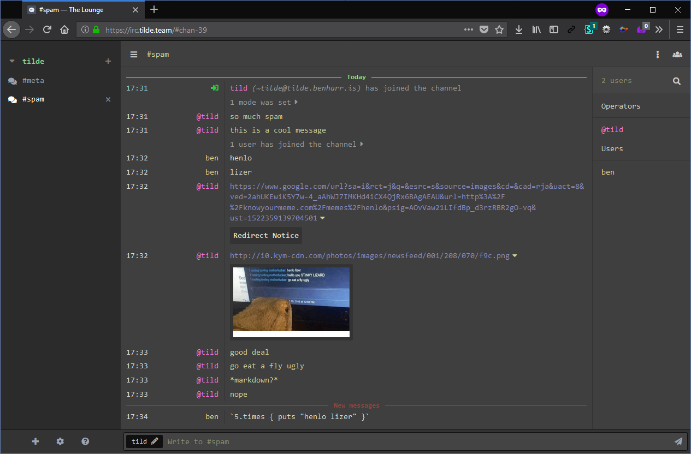

# lounge-zenburn-monospace

[](https://www.npmjs.com/package/thelounge-theme-zenburn-monospace)

fork of [thelounge's zenburn](https://github.com/thelounge/thelounge/blob/v3.0.0-pre.5/client/themes/zenburn.css) with all monospace fonts :)

you should be able to install this with:

```
thelounge install thelounge-theme-zenburn-monospace
```


